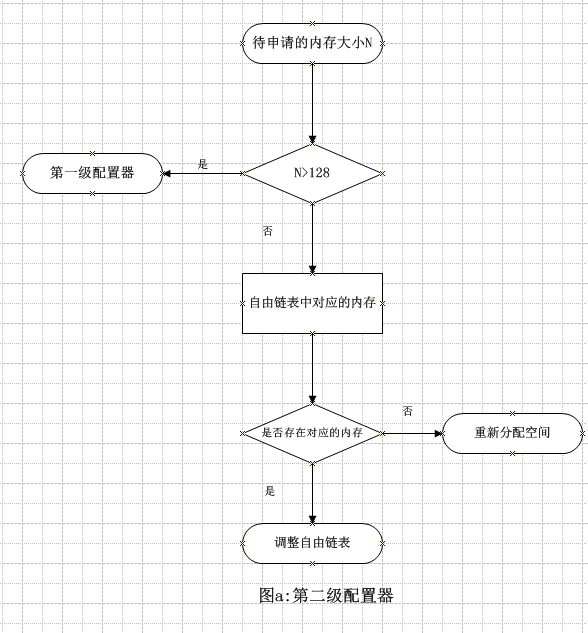

## 前言

[SGI STL源码](https://www.sgi.com/tech/stl/download.html)下载地址

空间配置是为存储数据提供可用的空间，在Standard Template Library(STL)中，空间配置是最底层的东西，为容器提供服务。在C++中，一般管理内存分配是使用new和delete进行操作，这两个操作都需要经过两个步骤；

new操作的步骤：(1)调用::operator new配置内存；(2)调用对象的构造函数构造对象并初始化。

delete操作步骤：(1)调用对象的析构函数析构对象；(2)调用::operator delete释放内存。例如：

```cpp
class Foo { ... };
Foo* pf = new Foo;
...
delete pf;
```

而在STL中，空间配置在C++的基础上增加了一些特性。STL allocator 将这两个阶段分开操作，内存配置操作由空间配置器stl::alloc中的alloc::allocate()，内存释放由alloc::deallocate()负责；对象构造操作由::construct()负责，对象析构操作由::destroy()负责。SGI STL中考虑到了异常处理，内置轻量级内存池（主要用于处理小块内存的分配，应对内存碎片问题）实现，多线程中的内存分配处理（主要是针对内存池的互斥访问）等。

## 空间配置器的标准接口

在SGI STL中，空间配置器(Allocator)的主要实现文件是`alloc.h`和`stl_alloc.h`，标准接口位于文件`stl_alloc.h`的588-628行；具体如下：

```cpp
/*tihs program is in the file of stl_alloc.h from line 588 to 628 */

template <class _Tp>
class allocator {
  typedef alloc _Alloc;          // The underlying allocator.
public:							//数据类型的成员变量在后续章节(traits编程技巧)介绍
  typedef size_t     size_type;
  typedef ptrdiff_t  difference_type;
  typedef _Tp*       pointer;
  typedef const _Tp* const_pointer;
  typedef _Tp&       reference;
  typedef const _Tp& const_reference;
  typedef _Tp        value_type;

  template <class _Tp1> struct rebind {//嵌套一个template,且仅包含唯一成员other,是一个typedef;
    typedef allocator<_Tp1> other;
  };
  //下面是成员函数
  allocator() __STL_NOTHROW {}	//默认构造函数,__STL_NOTHROW在 stl_config.h中定义,要么为空,要么为 throw()异常机制
  allocator(const allocator&) __STL_NOTHROW {}	//复制构造函数
  template <class _Tp1> allocator(const allocator<_Tp1>&) __STL_NOTHROW {}//泛化的复制构造函数
  ~allocator() __STL_NOTHROW {}//析构函数

  pointer address(reference __x) const { return &__x; }//返回对象的地址
  const_pointer address(const_reference __x) const { return &__x; }//返回const对象的地址

  // __n is permitted to be 0.  The C++ standard says nothing about what
  // the return value is when __n == 0.
  _Tp* allocate(size_type __n, const void* = 0) {// 配置空间，如果申请的空间块数不为0，那么调用 _Alloc 也即 alloc 的 allocate 函数来分配内存，
 //这里的 alloc 在 SGI STL 中默认使用的是__default_alloc_template<__NODE_ALLOCATOR_THREADS, 0>这个实现（见第402行）
    return __n != 0 ? static_cast<_Tp*>(_Alloc::allocate(__n * sizeof(_Tp))) 
                    : 0;
  }

  // __p is not permitted to be a null pointer.
  void deallocate(pointer __p, size_type __n)//释放已配置的空间
    { _Alloc::deallocate(__p, __n * sizeof(_Tp)); }

  size_type max_size() const __STL_NOTHROW //返回可成功配置的最大值
    { return size_t(-1) / sizeof(_Tp); }

  void construct(pointer __p, const _Tp& __val) { new(__p) _Tp(__val); }//构造，等同于new ((void*)p) T(x)
  void destroy(pointer __p) { __p->~_Tp(); }//析构，等同于p->~T()
};
```

在SGI STL的的`stl_alloc.h`文件中，可以看到有以下几种空间配置的类模板：

```cpp
template <int __inst> class __malloc_alloc_template 
// Malloc-based allocator.  Typically slower than default alloc
typedef __malloc_alloc_template<0> malloc_alloc
template<class _Tp, class _Alloc> class simple_alloc
template <class _Alloc> class debug_alloc
template <bool threads, int inst> class __default_alloc_template
 // Default node allocator.
typedef __default_alloc_template<__NODE_ALLOCATOR_THREADS, 0> alloc
typedef __default_alloc_template<false, 0> single_client_alloc
template <class _Tp>class allocator
template<>class allocator<void>
template <class _Tp, class _Alloc>struct __allocator
template <class _Alloc>class __allocator<void, _Alloc>
```

其中`simple_alloc`，`debug_alloc`，`allocator`和`__allocator`都是对其他适配器(如`__Alloc::allocate`)的一个简单封装。`__malloc_alloc_template`和`__default_alloc_template`这两个配置器就是SGI STL配置器的重点。其中`__malloc_alloc_template`是SGI STL的第一级配置器，只是对系统的malloc，realloc，free函数的一个简单封装，并考虑到了分配失败后的异常处理。而`__default_alloc_template`是SGI STL的第二级配置器，在第一级配置器的基础上还考虑了内存碎片的问题，通过内置一个轻量级的内存池，及在多线程环境下内存池互斥访问的机制。

## 第一级配置器__malloc_alloc_template:异常处理

第一级配置器内存分配失败一般是由于内存不足out-of-memory(oom)，处理异常时，首先用户自己设计异常处理例程，若用户没有定义，仅仅是打印错误信息并强制退出。总的来说，就是留给用户异常处理接口和默认强制退出处理。

```cpp
//异常处理
/*tihs program is in the file of stl_alloc.h*/
//line 109 to 118
class __malloc_alloc_template {

private:
//内存不足异常处理
  static void* _S_oom_malloc(size_t);
  static void* _S_oom_realloc(void*, size_t);

#ifndef __STL_STATIC_TEMPLATE_MEMBER_BUG
  static void (* __malloc_alloc_oom_handler)();
#endif
  //line 141 to 146
  //指定自己的异常处理
  static void (* __set_malloc_handler(void (*__f)()))()
  {
    void (* __old)() = __malloc_alloc_oom_handler;
    __malloc_alloc_oom_handler = __f;
    return(__old);
  }
//line 152 to 155
#ifndef __STL_STATIC_TEMPLATE_MEMBER_BUG
template <int __inst>
void (* __malloc_alloc_template<__inst>::__malloc_alloc_oom_handler)() = 0;
#endif
//line 41 to 50
#ifndef __THROW_BAD_ALLOC
#  if defined(__STL_NO_BAD_ALLOC) || !defined(__STL_USE_EXCEPTIONS)
#    include <stdio.h>
#    include <stdlib.h>
//默认的强制退出
#    define __THROW_BAD_ALLOC fprintf(stderr, "out of memory\n"); exit(1)
#  else /* Standard conforming out-of-memory handling */
#    include <new>
//抛出用户设计异常处理例程
#    define __THROW_BAD_ALLOC throw std::bad_alloc()
#  endif
#endif
```

## 第二级配置器__default_alloc_template

第二级配置器主要是利用内存池进行管理小内存分配问题，并且在多线程环境下内存池的互斥访问问题。第一级配置器`__malloc_alloc_template`只是malloc对的一层封装，没有考虑内存碎片问题。因此，第二级配置器是在第一级配置器的基础上考虑了内存碎片问题，对于申请内存大于128bytes移交给第一级配置器`__malloc_alloc_template`处理。对于**小内存(小于128bytes)**的申请，利用内存池来管理，直接从内存池分配即可，并维护自由链表，自由链表是来分配同样的小内存和回收小内存，即程序再次申请小内存直接从自由链表中分配，当小内存释放时，自由链表对其进行回收。

为了方便管理，SGI STL第二级配置器会主动将任何小额区块的内存需求量上调为8的倍数，即若用户申请的小额区块内存不满足8的倍数时，系统自动向上取整为8的倍数。由于SGI STL第二级配置器要求小额区块的内存最大为128bytes，则自由链表的个数为16个，即128/8=16；每个链表分别维护区块内存大小为bytes。

下面给出第二级配置器处理的流程图和源代码：



```cpp
/*tihs program is in the file of stl_alloc.h from line 288 to 375 */
//第二级配置器__default_alloc_template
template <bool threads, int inst>
class __default_alloc_template {

private:
  // Really we should use static const int x = N
  // instead of enum { x = N }, but few compilers accept the former.
#if ! (defined(__SUNPRO_CC) || defined(__GNUC__))
    enum {_ALIGN = 8};//小额区块的上调边界
    enum {_MAX_BYTES = 128};//小额区块的最大内存
    enum {_NFREELISTS = 16}; // _MAX_BYTES/_ALIGN;自由链表个数
# endif
  static size_t
  _S_round_up(size_t __bytes) //函数功能：调整内存大小为8的倍数
    { return (((__bytes) + (size_t) _ALIGN-1) & ~((size_t) _ALIGN - 1)); }

__PRIVATE:
  union _Obj {//自由链表节点属性
        union _Obj* _M_free_list_link;
        char _M_client_data[1];    /* The client sees this.        */
  };
private:
# if defined(__SUNPRO_CC) || defined(__GNUC__) || defined(__HP_aCC)
    static _Obj* __STL_VOLATILE _S_free_list[]; 
        // Specifying a size results in duplicate def for 4.1
# else
    static _Obj* __STL_VOLATILE _S_free_list[_NFREELISTS]; 
# endif
  static  size_t _S_freelist_index(size_t __bytes) {//函数功能：计算所申请区块内存在自由链表中对应的号数,从0开始
        return (((__bytes) + (size_t)_ALIGN-1)/(size_t)_ALIGN - 1);
  }

  // Returns an object of size __n, and optionally adds to size __n free list.
  static void* _S_refill(size_t __n);//填充空间,把大小为n的内存空间加到自由链表
  // Allocates a chunk for nobjs of size size.  nobjs may be reduced
  // if it is inconvenient to allocate the requested number.
  /*从内存池中分配空间，该空间可容纳__nobjs大小为__size的区块，可能会少于__nobjs个*/
  static char* _S_chunk_alloc(size_t __size, int& __nobjs);

  // Chunk allocation state.
  static char* _S_start_free;//内存池起始位置
  static char* _S_end_free;//内存池结束位置
  static size_t _S_heap_size;

# ifdef __STL_THREADS
    static _STL_mutex_lock _S_node_allocator_lock;
# endif

    // It would be nice to use _STL_auto_lock here.  But we
    // don't need the NULL check.  And we do need a test whether
    // threads have actually been started.
    class _Lock;
    friend class _Lock;
    class _Lock {//该类保证内存池在多线程环境解决互斥访问
        public:
            _Lock() { __NODE_ALLOCATOR_LOCK; }
            ~_Lock() { __NODE_ALLOCATOR_UNLOCK; }
    };
	public:

  /* __n must be > 0      */
  static void* allocate(size_t __n)
  {
    void* __ret = 0;

    if (__n > (size_t) _MAX_BYTES) {
      __ret = malloc_alloc::allocate(__n);//内存大于128时，采用第一级配置器处理
    }
    else {
      _Obj* __STL_VOLATILE* __my_free_list
          = _S_free_list + _S_freelist_index(__n);
      // Acquire the lock here with a constructor call.
      // This ensures that it is released in exit or during stack
      // unwinding.
#     ifndef _NOTHREADS
      /*REFERENCED*/
      _Lock __lock_instance;
#     endif
      _Obj* __RESTRICT __result = *__my_free_list;
      if (__result == 0)
        __ret = _S_refill(_S_round_up(__n));
      else {
        *__my_free_list = __result -> _M_free_list_link;
        __ret = __result;
      }
    }

    return __ret;
  };

//初始化操作
//line from 554 to 571
  template <bool __threads, int __inst>
char* __default_alloc_template<__threads, __inst>::_S_start_free = 0;

template <bool __threads, int __inst>
char* __default_alloc_template<__threads, __inst>::_S_end_free = 0;

template <bool __threads, int __inst>
size_t __default_alloc_template<__threads, __inst>::_S_heap_size = 0;

template <bool __threads, int __inst>
typename __default_alloc_template<__threads, __inst>::_Obj* __STL_VOLATILE
__default_alloc_template<__threads, __inst> ::_S_free_list[
# if defined(__SUNPRO_CC) || defined(__GNUC__) || defined(__HP_aCC)
    _NFREELISTS
# else
    __default_alloc_template<__threads, __inst>::_NFREELISTS
# endif
] = {0, 0, 0, 0, 0, 0, 0, 0, 0, 0, 0, 0, 0, 0, 0, 0, };
```

## 空间配置函数allocate()

空间配置函数allocate()的具体实现步骤如下：

1. 若用户申请的内存大于128bytes，则调用第一级配置器分配空间；
2. 若小于128bytes检查对应的自由链表`free_list`，如果自由链表存在可用的区块，则直接使用，若不存在，则调用填充函数refill()为自由链表重新填充空间；

空间配置函数allocate()的源代码如下：

```cpp
 /* __n must be > 0      */
  static void* allocate(size_t __n)
  {
    void* __ret = 0;

    if (__n > (size_t) _MAX_BYTES) {
      __ret = malloc_alloc::allocate(__n);//内存大于128时，采用第一级配置器处理
    }
    else {
      _Obj* __STL_VOLATILE* __my_free_list
          = _S_free_list + _S_freelist_index(__n);
      // Acquire the lock here with a constructor call.
      // This ensures that it is released in exit or during stack
      // unwinding.
#     ifndef _NOTHREADS
      /*REFERENCED*/
      _Lock __lock_instance;
#     endif
      _Obj* __RESTRICT __result = *__my_free_list;
      if (__result == 0)//若自由链表free_list不存在可用的区块，则从内存池中填充自由链表
        __ret = _S_refill(_S_round_up(__n));
      else {//若自由链表free_list存在可用区块，调整free_list
        *__my_free_list = __result -> _M_free_list_link;
        __ret = __result;
      }
    }

    return __ret;
  };
```

## 空间释放函数deallocate()

首先判断区块的大小，大于128bytes直接调用第一级配置器，若小于128bytes，则找出相应的自由链表`free_list`，将其回收。源代码如下：

```cpp
  /* __p may not be 0 */
  static void deallocate(void* __p, size_t __n)
  {
    if (__n > (size_t) _MAX_BYTES)//内存大于128时，采用第一级配置器处理
      malloc_alloc::deallocate(__p, __n);
    else {//否则，找到相应的自由链表位置，将其回收
      _Obj* __STL_VOLATILE*  __my_free_list
          = _S_free_list + _S_freelist_index(__n);
      _Obj* __q = (_Obj*)__p;

      // acquire lock
#       ifndef _NOTHREADS
      /*REFERENCED*/
      _Lock __lock_instance;
#       endif /* _NOTHREADS */
      __q -> _M_free_list_link = *__my_free_list;
      *__my_free_list = __q;
      // lock is released here
    }
  }
```

## 重新填充函数refill()

重新填充函数refill()是在自由链表不存在可用的区块时被调用。默认是为自由链表申请20个节点，第1个给客户端，剩下19个留给自由链表管理。原代码如下：

```cpp
/* Returns an object of size __n, and optionally adds to size __n free list.*/
/* We assume that __n is properly aligned.                                */
/* We hold the allocation lock.                                         */
template <bool __threads, int __inst>
void*
__default_alloc_template<__threads, __inst>::_S_refill(size_t __n)
{
    int __nobjs = 20;//默认节点数
	//调用_S_chunk_alloc，从内存池中获得内存空间
    char* __chunk = _S_chunk_alloc(__n, __nobjs);
    _Obj* __STL_VOLATILE* __my_free_list;
    _Obj* __result;
    _Obj* __current_obj;
    _Obj* __next_obj;
    int __i;

	//如果只有一个区块，返回给客户端，自由链表没有接区块管理
    if (1 == __nobjs) return(__chunk);
	//调整自由链表free_list，准备管理新节点
    __my_free_list = _S_free_list + _S_freelist_index(__n);

    /* Build free list in chunk */
      __result = (_Obj*)__chunk;//这一块返回给客户端
	  //自由链表free_list指向新配置的空间
      *__my_free_list = __next_obj = (_Obj*)(__chunk + __n);
      for (__i = 1; ; __i++) {//这里第0个返回给客户端，所以从1开始
        __current_obj = __next_obj;
        __next_obj = (_Obj*)((char*)__next_obj + __n);
        if (__nobjs - 1 == __i) {
            __current_obj -> _M_free_list_link = 0;
            break;
        } else {
            __current_obj -> _M_free_list_link = __next_obj;
        }
      }
    return(__result);
}
```

## 内存池管理机制

`chunk_alloc`函数具体实现步骤如下：

1. 内存池剩余空间完全满足20个区块的需求量，则直接获取对应大小的空间。
2. 内存池剩余空间不能完全满足20个区块的需求量，但是足够供应一个及以上的区块，则获取满足条件的区块个数的空间。
3. 内存池剩余空间不能满足一个区块的大小，则：

* 首先判断内存池中是否有残余零头内存空间，如果有则进行回收，将其编入`free_list`。
* 然后向heap申请空间，补充内存池。
* heap有足够的空间，空间分配成功。
* heap空间不足，即malloc()调用失败。则
* 查找`free_list中`尚有未用区块，调整以进行释放，将其编入内存池。然后递归调用`chunk_alloc`函数从内存池取空间供`free_list`备用。
* 搜寻`free_list`释放空间也未能解决问题，这时候调用第一级配置器，利用out-of-memory机制尝试解决内存不足问题。

源代码如下：

```cpp
/* We allocate memory in large chunks in order to avoid fragmenting     */
/* the malloc heap too much.                                            */
/* We assume that size is properly aligned.                             */
/* We hold the allocation lock.                                         */
template <bool __threads, int __inst>
char*
__default_alloc_template<__threads, __inst>::_S_chunk_alloc(size_t __size, 
                                                            int& __nobjs)
{
    char* __result;
    size_t __total_bytes = __size * __nobjs;//所需总的内存块
    size_t __bytes_left = _S_end_free - _S_start_free;//内存池剩余空间

    if (__bytes_left >= __total_bytes) {//若内存池剩余空间满足20个需求，直接分配
        __result = _S_start_free;
        _S_start_free += __total_bytes;
        return(__result);
    } else if (__bytes_left >= __size) {
		/*若内存池剩余空间不满足20个需求，但足够满足一个或多个，取出能够满足条件区块的个数*/
        __nobjs = (int)(__bytes_left/__size);
        __total_bytes = __size * __nobjs;
        __result = _S_start_free;
        _S_start_free += __total_bytes;
        return(__result);
    } else {
		/*内存池剩余空间连一个区块大小都无法提供*/
        size_t __bytes_to_get = 
	  2 * __total_bytes + _S_round_up(_S_heap_size >> 4);
        // Try to make use of the left-over piece.
        if (__bytes_left > 0) {
			/*判断内存池中是否有残余零头内存空间，如果有则进行回收，将其编入free list*/
            _Obj* __STL_VOLATILE* __my_free_list =
                        _S_free_list + _S_freelist_index(__bytes_left);

            ((_Obj*)_S_start_free) -> _M_free_list_link = *__my_free_list;
            *__my_free_list = (_Obj*)_S_start_free;
        }
		//配置可用的堆空间，用来补充内存池空间
        _S_start_free = (char*)malloc(__bytes_to_get);
        if (0 == _S_start_free) {//若堆空间不足
            size_t __i;
            _Obj* __STL_VOLATILE* __my_free_list;
	    _Obj* __p;
            // Try to make do with what we have.  That can't
            // hurt.  We do not try smaller requests, since that tends
            // to result in disaster on multi-process machines.
            for (__i = __size;
                 __i <= (size_t) _MAX_BYTES;
                 __i += (size_t) _ALIGN) {
	/*搜寻适当的free list（适当的是指：尚有未用区块，并且区块足够大），调整以进行释放，将其编入内存池。
					 **然后递归调用chunk_alloc函数从内存池取空间供free list。*/
                __my_free_list = _S_free_list + _S_freelist_index(__i);
                __p = *__my_free_list;
                if (0 != __p) {//自由练表中存在未被使用的区块，调整并释放该区块
                    *__my_free_list = __p -> _M_free_list_link;
                    _S_start_free = (char*)__p;
                    _S_end_free = _S_start_free + __i;
                    return(_S_chunk_alloc(__size, __nobjs));
                    // Any leftover piece will eventually make it to the
                    // right free list.
                }
            }
	    _S_end_free = 0;	// In case of exception.调用第一级配置器
            _S_start_free = (char*)malloc_alloc::allocate(__bytes_to_get);
            // This should either throw an
            // exception or remedy the situation.  Thus we assume it
            // succeeded.
        }
        _S_heap_size += __bytes_to_get;
        _S_end_free = _S_start_free + __bytes_to_get;
        return(_S_chunk_alloc(__size, __nobjs));
    }
}
```

## 多线程环境下内存池互斥访问

在第二级配置器中，存在着多线程环境的内存池管理，解决多线程环境下内存池互斥访问，需在自由链表`free_list`中进行修改调整，我们从SGI STL第二级配置器源码中看到，嵌套一个类`class _Lock` ，该类的作用是解决互斥访问，并且只有两个函数：构造函数和析构函数；使用构造函数对内存池进行加锁，使用析构函数对内存池进行解锁。关于多线程内存池互斥访问的源代码如下：

```cpp
#ifdef __STL_THREADS
# include <stl_threads.h>//包含线程文件
# define __NODE_ALLOCATOR_THREADS true
# ifdef __STL_SGI_THREADS
  // We test whether threads are in use before locking.
  // Perhaps this should be moved into stl_threads.h, but that
  // probably makes it harder to avoid the procedure call when
  // it isn't needed.
    extern "C" {
      extern int __us_rsthread_malloc;
    }
	// The above is copied from malloc.h.  Including <malloc.h>
	// would be cleaner but fails with certain levels of standard
	// conformance.
#   define __NODE_ALLOCATOR_LOCK if (threads && __us_rsthread_malloc) \
                { _S_node_allocator_lock._M_acquire_lock(); }
#   define __NODE_ALLOCATOR_UNLOCK if (threads && __us_rsthread_malloc) \
                { _S_node_allocator_lock._M_release_lock(); }
# else /* !__STL_SGI_THREADS */
#   define __NODE_ALLOCATOR_LOCK \
        { if (threads) _S_node_allocator_lock._M_acquire_lock(); }//获取锁
#   define __NODE_ALLOCATOR_UNLOCK \
        { if (threads) _S_node_allocator_lock._M_release_lock(); }//释放锁
# endif
#else
//  Thread-unsafe
#   define __NODE_ALLOCATOR_LOCK
#   define __NODE_ALLOCATOR_UNLOCK
#   define __NODE_ALLOCATOR_THREADS false
#endif

# ifdef __STL_THREADS
    static _STL_mutex_lock _S_node_allocator_lock;//互斥锁变量
# endif

    // It would be nice to use _STL_auto_lock here.  But we
    // don't need the NULL check.  And we do need a test whether
    // threads have actually been started.
    class _Lock;
    friend class _Lock;
    class _Lock {//解决内存池在多线程环境下的管理
        public:
            _Lock() { __NODE_ALLOCATOR_LOCK; }
            ~_Lock() { __NODE_ALLOCATOR_UNLOCK; }
    };
```

## 参考资料：

* http://ibillxia.github.io/blog/2014/06/13/stl-source-insight-1-memory-allocator/
* http://blog.csdn.net/xiajun07061225/article/details/8807890
* http://www.cnblogs.com/kanego/archive/2012/08/14/2638818.html
