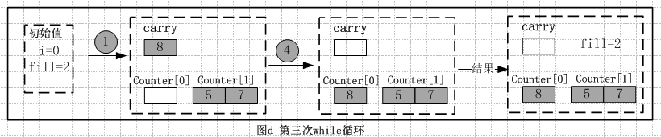

## 前言

由于STL本身的排序算法sort接受的输入迭代器是随机访问迭代器，但是双向list链表容器的访问方式是双向迭代器，因此，不能使用STL本身的排序算法sort，必须自己定义属于自己访问的排序算法。我们从源码的剖析中，可以看到该排序算法思想类似于归并排序。

## list容器之排序算法sort

在该排序算法的实现过程中，定义了一个类似于搬运作用的链表carry和具有中转站作用的链表counter，这里首先对`counter[i]`里面存储数据的规则进行分析；`counter[i]`里面最多存储数据个数为，若存储数据超过该数字，则向相邻高位进位，即把`counter[i]`链表里的内容都合并到`counter[i+1]`链表。carry负责取出原始链表的头一个数据节点和交换数据中转站作用；源码中的fill表示当前可处理数据的个数为。下面给出sort的源码分析：

```cpp
//按升序进行排序，list链表的迭代器访问时双向迭代器
//因为STL的排序算法函数sort()是接受随机访问迭代器，在这里并不适合
template <class _Tp, class _Alloc>
void list<_Tp, _Alloc>::sort()
{
  // Do nothing if the list has length 0 or 1.
  if (_M_node->_M_next != _M_node && _M_node->_M_next->_M_next != _M_node) 
  {
    list<_Tp, _Alloc> __carry;//carry链表起到搬运的作用
	//counter链表是中间存储作用
	/*
	*其中对于counter[i]里面最多的存储数据为2^(i+1)个节点
	*若超出则向高位进位即counter[i+1]
	*/
    list<_Tp, _Alloc> __counter[64];
    int __fill = 0;
    while (!empty()) 
	{//若不是空链表
		//第一步：
      __carry.splice(__carry.begin(), *this, begin());//把当前链表的第一个节点放在carry链表头
      int __i = 0;
      while(__i < __fill && !__counter[__i].empty()) 
	  {
        //第二步：
		  __counter[__i].merge(__carry);//把链表carry合并到counter[i]
        //第三步：
		  __carry.swap(__counter[__i++]);//交换链表carry和counter[i]内容
      }
      //第四步：
	  __carry.swap(__counter[__i]);//交换链表carry和counter[i]内容         
      //第五步：
	  if (__i == __fill) ++__fill;
    } 

    for (int __i = 1; __i < __fill; ++__i)
      //第六步：
		__counter[__i].merge(__counter[__i-1]);//把低位不满足进位的剩余数据全部有序的合并到上一位
    //第七步：
	swap(__counter[__fill-1]);//最后把已排序好的链表内容交换到当前链表
  }
}
```

从源码中，我们可以看到，第一个while循环执行的条件是当前链表必须非空，该算法的核心就是while里面的处理，嵌套while(即第二个while)执行的条件是i小于fill且`counter[i]`链表是非空；下面给出实例进行分析，在分析之前先做一些规定：

把第20行语句`carry.splice(carry.begin(), *this, begin())`标记为下图中执行的步骤1；
把第25行语句`counter[i].merge(carry)`标记为下图中执行的步骤2；
把第27行语句`carry.swap(counter[i++])`标记为下图中执行的步骤3；
把第30行语句`carry.swap(counter[i])`标记为下图中执行的步骤4；
把第32行语句`if (i == fill) ++fill`标记为下图中执行的步骤5；
把第37行for循环里面语句`counter[i].merge(counter[i-1])`标记为下图中执行的步骤6；
把第39行最后一个语句`swap(counter[fill-1])`标记为下图中执行的步骤7；

下图是待排序的原始链表：


下面是排序算法sort的执行过程，定义初始值fill=0，因为原始链表有四个节点，即原始链表非空，则执行while循环里面的语句：注：由于方便画图，下面相邻方块之间表示是双向链表的连接；白色的方块表示空链表；

第一次执行while**循环：**步骤1搬运链表carry取出当前链表的第一个数据节点7，初始值i=0，由于嵌套while循环条件不成立，则跳过嵌套while循环，直接进入到步骤4，交换carry和counteri的内容；又因为此时i=fill，则更新值++fill，即fill=1；流图如下：


第二次执行while**循环：**步骤1搬运链表carry取出当前链表的第一个数据节点5，初始值i=0，由于嵌套while循环条件成立，步骤2将carry链表的内容有序的合并到counteri链表中，再执行步骤3交换`carry`和`counter[0]`内容且`i++`，此时carry有两个有序的节点5和7，`counter[0]`为空链表，i的值为i=1；这时嵌套while循环条件不成立；跳转到步骤4交换`carry`和`counter[1]`的内容，且执行步骤5更新fill的值++fill，第二次while循环执行结束时，数据节点的状况为：`carry`和`counter[0]`内容都为空，`counter[1]`有两个有序的节点5和7，值fill=2；流图如下：


**第三次执行while循环：**步骤1搬运链表carry取出当前链表的第一个数据节点8，初始值i=0，由于嵌套while循环条件不成立，则跳过嵌套while循环，直接进入到步骤4，交换carry和counteri的内容；又因为此时i不等于fill，则不更新fill值，即fill=2；第三次while循环执行结束时，数据节点的状况为：carry为空，counter[0]内容为一个节点8，counter[1]有两个有序的节点5和7，值fill=2；流图如下：



**第四次执行while循环：**步骤1搬运链表carry取出当前链表的第一个数据节点1，初始值i=0，由于嵌套while循环条件成立，步骤2将carry链表的内容有序的合并到counteri链表中，再执行步骤3交换`carry`和`counter[0]`内容且i++，此时carry有两个有序的节点1和8，`counter[0]`为空链表，i的值为i=1；这时嵌套while循环条件依然成立；继续执行步骤2将carry的内容有序的合并到`counter[1]`链表中，再执行步骤3交换`carry`和`counter[1]`的内容且++i，此时，carry内容为四个有序的节点1、5、7和8，`counter[0]`和`counter[1]`的内容都为空链表，i的值为i=2；这时嵌套while循环条件不成立；跳转到步骤4交换`carry`和`counter[2]`的内容，且执行步骤5更新fill的值++fill，第四次while循环执行结束时，数据节点的状况为：`carry`、`counter[0]`和`counter[1]`内容都为空，`counter[2]`有四个有序的节点1、5、7和8，值fill=3；流图如下：


最后，由于此时当前链表为空链表，则跳出while循环，执行for语句，因为i=2之前的`counter[1]`和`counter[0]`内容都为空，则执行完for语句之后链表都没变化，然后执行步骤7交换当前链表和`counter[2]`的内容，执行完后，`counter[2]`为空，当前链表内容为四个有序的节点1、5、7和8；流程如下：


以上是list排序算法的整个流程，关键是要理解其核心，不断地更新链表内容。

## 参考资料

*《STL源码剖析》侯捷；
* [《STL源码剖析之list的sort函数实现》](http://www.cnblogs.com/wwblog/p/3653055.html)
* 