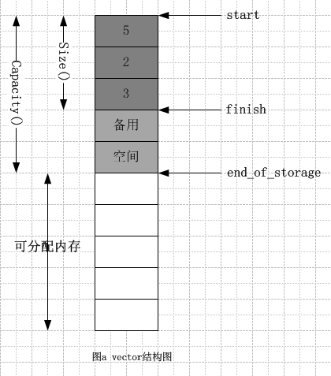
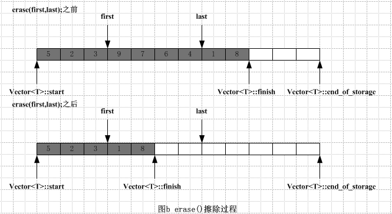

## 前言

在STL编程中，我们最常用到的就是容器，容器可分为序列容器和关联容器；本文记录的是我们经常使用的序列容器之vector，vector的数据安排和操作方式类似于C++内置数组类型array，唯一的区别就是在于空间的灵活运用。内置数组array是静态空间，一旦分配了内存空间就不能改变，而vector容器可以根据用户数据的变化而不断调整内存空间的大小。

vector容器有已使用空间和可用空间，已使用空间是指vector容器的大小，可用空间是指vector容器可容纳的最大数据空间capacity。vector容器是占用一段连续线性空间，所以vector容器的迭代器就等价于原生态的指针；vector的实现依赖于内存的配置和内存的初始化，以及迭代器。其中内存的配置是最重要的，因为每当配置内存空间时，可能会发生数据移动，回收旧的内存空间，如果不断地重复这些操作会降低操作效率，所有vector容器在分配内存时，并不是用户数据占多少就分配多少，它会分配一些内存空间留着备用，即是用户可用空间。关于vector类定义可参考[《vector库文件》](http://zh.cppreference.com/w/cpp/container/vector)或者[《MSDN库的vector类》](https://learn.microsoft.com/en-us/cpp/standard-library/vector-class?view=msvc-170&redirectedfrom=MSDN)；以下源代码在SGI STL的文件<stl_vector.h>中。

## vector容器
### vector容器的数据结构

vector容器采用的是线性连续空间的数据结构，使用两个迭代器来管理这片连续内存空间，这两个迭代器分别是指向目前使用空间的头start和指向目前使用空间的尾finish，两个迭代器的范围`[start,finish)`表示容器的大小`size()`。由于为了提高容器的访问效率，为用户分配内存空间时，会分配多余的备用空间，即容器的容量，以迭代器`end_of_storage`作为可用空间的尾，则容器的容量`capacity()`为`[start,end_of_storage)`范围的线性连续空间。

```cpp
//Alloc是SGI STL的空间配置器，默认是第二级配置器
template <class _Tp, class _Alloc = __STL_DEFAULT_ALLOCATOR(_Tp) >
class vector : protected _Vector_base<_Tp, _Alloc> 
{
       ...
protected:
  _Tp* _M_start;//表示目前使用空间的头
  _Tp* _M_finish;//表示目前使用空间的尾
  _Tp* _M_end_of_storage;//表示目前可用空间的尾  
    ...
};
```

下面给出vector的数据结构图：



### vector迭代器

vector容器维护的空间的线性连续的，所以普通指针也可以作为迭代器，满足vector的访问操作；如：`operator*`，`operator->`，`operator++`，`operator--`，`operator+`，`operator-`，`operator+=`，`operator-=`等操作；同时vector容器支持随机访问，所以，vector提供的是随机访问迭代器。

```cpp
//Alloc是SGI STL的空间配置器，默认是第二级配置器
template <class _Tp, class _Alloc = __STL_DEFAULT_ALLOCATOR(_Tp) >
class vector : protected _Vector_base<_Tp, _Alloc> 
{
  
public://vector的内嵌型别定义,是iterator_traits<I>服务的类型
  typedef _Tp value_type;
  typedef value_type* pointer;
  typedef const value_type* const_pointer;
  typedef value_type* iterator;//vector容器的迭代器是普通指针
  typedef const value_type* const_iterator;
  ...

  public://以下定义vector迭代器
  iterator begin() { return _M_start; }//指向已使用空间头的迭代器
  const_iterator begin() const { return _M_start; }
  iterator end() { return _M_finish; }//指向已使用空间尾的迭代器
  const_iterator end() const { return _M_finish; }

  reverse_iterator rbegin()
    { return reverse_iterator(end()); }
  const_reverse_iterator rbegin() const
    { return const_reverse_iterator(end()); }
  reverse_iterator rend()
    { return reverse_iterator(begin()); }
  const_reverse_iterator rend() const
    { return const_reverse_iterator(begin()); }
	...
};
```

### vector的构造函数和析构函数

这里把vector容器的构造函数列出来讲解，主要是我们平常使用vector容器时，首先要要定义相应的容器对象，所以，如果我们对vector容器的构造函数了解比较透彻时，在应用当中就会比较得心应手。在以下源码的前面我会总结出vector容器的构造函数及其使用方法。

```cpp
 /*以下是vector容器的构造函数***********************
/************************************
***	//默认构造函数***************************
*	explicit vector( const Allocator& alloc = Allocator() );		  *
***	//具有初始值和容器大小的构造函数*******************
*	explicit vector( size_type count,								  *
*              const T& value = T(),                               *
*              const Allocator& alloc = Allocator());              *
*      vector( size_type count,                                    *
*              const T& value,                                     *
*              const Allocator& alloc = Allocator());              *
***	//只有容器大小的构造函数***********************
*	explicit vector( size_type count );                               *
***	//用两个迭代器区间表示容器大小的构造函数***************
*	template< class InputIt >                                         *
*	vector( InputIt first, InputIt last,                              *
*     const Allocator& alloc = Allocator() );                      *  
***	//拷贝构造函数***************************
*	vector( const vector& other );                                    *
*	vector( const vector& other, const Allocator& alloc );            * 
***	//移动构造函数***************************
*	vector( vector&& other );                                         *
*	vector( vector&& other, const Allocator& alloc );                 *
***	//用初始列表的值构造容器，列表内的元素值可以不同***********
*	vector( std::initializer_list<T> init,                            *
*     const Allocator& alloc = Allocator() );                      *
*************************************/ 
  explicit vector(const allocator_type& __a = allocator_type())
    : _Base(__a) {}//默认构造函数

  vector(size_type __n, const _Tp& __value,
         const allocator_type& __a = allocator_type()) 
    : _Base(__n, __a)//构造函数，里面包含n个初始值为value的元素
	//全局函数，填充值函数，即从地址M_start开始连续填充n个初始值为value的元素
    { _M_finish = uninitialized_fill_n(_M_start, __n, __value); }

  explicit vector(size_type __n)//该构造函数不接受初始值，只接受容易包含元素的个数n
    : _Base(__n, allocator_type())
    { _M_finish = uninitialized_fill_n(_M_start, __n, _Tp()); }

  vector(const vector<_Tp, _Alloc>& __x) 
    : _Base(__x.size(), __x.get_allocator())//拷贝构造函数
    { _M_finish = uninitialized_copy(__x.begin(), __x.end(), _M_start); }

#ifdef __STL_MEMBER_TEMPLATES
  // Check whether it's an integral type.  If so, it's not an iterator.
  /*这个是某个区间的构造函数，首先判断输入是否为整数_Integral()
  *采用__type_traits技术
  */
  template <class _InputIterator>
  vector(_InputIterator __first, _InputIterator __last,
         const allocator_type& __a = allocator_type()) : _Base(__a) {
    typedef typename _Is_integer<_InputIterator>::_Integral _Integral;
    _M_initialize_aux(__first, __last, _Integral());
  }

  template <class _Integer>
  //若输入为整数，则调用该函数
  void _M_initialize_aux(_Integer __n, _Integer __value, __true_type) {
    _M_start = _M_allocate(__n);
    _M_end_of_storage = _M_start + __n; 
    _M_finish = uninitialized_fill_n(_M_start, __n, __value);
  }

  template <class _InputIterator>
  //若输入不是整数，则采用Traits技术继续判断迭代器的类型
  void _M_initialize_aux(_InputIterator __first, _InputIterator __last,
                         __false_type) {
    _M_range_initialize(__first, __last, __ITERATOR_CATEGORY(__first));
  }

#else
  vector(const _Tp* __first, const _Tp* __last,
         const allocator_type& __a = allocator_type())
    : _Base(__last - __first, __a) 
    { _M_finish = uninitialized_copy(__first, __last, _M_start); }
#endif /* __STL_MEMBER_TEMPLATES */

  ~vector() { destroy(_M_start, _M_finish); }//析构函数
```

### vector容器的成员函数

vector容器的成员函数使我们访问容器时经常会用到，为了加深对其了解，这里单独对成员函数源码进行了详细的注解。

```cpp
    /*以下是容器的一些成员函数*/
  size_type size() const//vector容器大小(已使用空间大小)，即容器内存储元素的个数
    { return size_type(end() - begin()); }
  size_type max_size() const//返回可容纳最大元素数
    { return size_type(-1) / sizeof(_Tp); }
  size_type capacity() const//vector容器可用空间的大小
    { return size_type(_M_end_of_storage - begin()); }
  bool empty() const//判断容器是否为空
    { return begin() == end(); }

  reference operator[](size_type __n) { return *(begin() + __n); }//返回指定位置的元素
  const_reference operator[](size_type __n) const { return *(begin() + __n); }

#ifdef __STL_THROW_RANGE_ERRORS
  //若用户要求的空间大于可用空间，抛出错去信息，即越界检查
  void _M_range_check(size_type __n) const {
    if (__n >= this->size())
      __stl_throw_range_error("vector");
  }

  reference at(size_type __n)//访问指定元素，并且进行越界检查
    { _M_range_check(__n); return (*this)[__n]; }//访问前，先进行越界检查
  const_reference at(size_type __n) const
    { _M_range_check(__n); return (*this)[__n]; }
#endif /* __STL_THROW_RANGE_ERRORS */

    void reserve(size_type __n) {//改变可用空间内存大小
    if (capacity() < __n) {
      const size_type __old_size = size();
	  //重新分配大小为n的内存空间，并把原来数据复制到新分配空间
      iterator __tmp = _M_allocate_and_copy(__n, _M_start, _M_finish);
      destroy(_M_start, _M_finish);//释放容器元素对象
      _M_deallocate(_M_start, _M_end_of_storage - _M_start);//回收原来的内存空间
	  //调整迭代器所指的地址,因为原来迭代器所指的地址已经失效
      _M_start = __tmp;
      _M_finish = __tmp + __old_size;
      _M_end_of_storage = _M_start + __n;
    }
  }

  reference front() { return *begin(); }//返回第一个元素
  const_reference front() const { return *begin(); }
  reference back() { return *(end() - 1); }//返回容器最后一个元素
  const_reference back() const { return *(end() - 1); }

  void push_back(const _Tp& __x) {//在最尾端插入元素
    if (_M_finish != _M_end_of_storage) {//若有可用的内存空间
      construct(_M_finish, __x);//构造对象
      ++_M_finish;
    }
    else//若没有可用的内存空间,调用以下函数，把x插入到指定位置
      _M_insert_aux(end(), __x);
  }
  void push_back() {
    if (_M_finish != _M_end_of_storage) {
      construct(_M_finish);
      ++_M_finish;
    }
    else
      _M_insert_aux(end());
  }
  void swap(vector<_Tp, _Alloc>& __x) {
	  /*交换容器的内容
	  *这里使用的方法是交换迭代器所指的地址
	  */
    __STD::swap(_M_start, __x._M_start);
    __STD::swap(_M_finish, __x._M_finish);
    __STD::swap(_M_end_of_storage, __x._M_end_of_storage);
  }

  iterator insert(iterator __position, const _Tp& __x) {//把x值插入到指定的位置
    size_type __n = __position - begin();
    if (_M_finish != _M_end_of_storage && __position == end()) {
      construct(_M_finish, __x);
      ++_M_finish;
    }
    else
      _M_insert_aux(__position, __x);
    return begin() + __n;
  }
  iterator insert(iterator __position) {
    size_type __n = __position - begin();
    if (_M_finish != _M_end_of_storage && __position == end()) {
      construct(_M_finish);
      ++_M_finish;
    }
    else
      _M_insert_aux(__position);
    return begin() + __n;
  }

  void insert (iterator __pos, size_type __n, const _Tp& __x)
    { //在pos位置连续插入n个初始值为x的元素
		_M_fill_insert(__pos, __n, __x); }

  void _M_fill_insert (iterator __pos, size_type __n, const _Tp& __x);

  void pop_back() {//取出最尾端元素
    --_M_finish;
    destroy(_M_finish);//析构对象
  }
  iterator erase(iterator __position) {//擦除指定位置元素
    if (__position + 1 != end())
      copy(__position + 1, _M_finish, __position);//后续元素前移一位
    --_M_finish;
    destroy(_M_finish);//析构对象
    return __position;
  }
  iterator erase(iterator __first, iterator __last) {//擦除两个迭代器区间的元素
    iterator __i = copy(__last, _M_finish, __first);//把不擦除的元素前移
    destroy(__i, _M_finish);//析构对象
    _M_finish = _M_finish - (__last - __first);//调整finish的所指的位置
    return __first;
  }

  void resize(size_type __new_size, const _Tp& __x) {//改变容器中可存储的元素个数，并不会分配新的空间
    if (__new_size < size()) //若调整后的内存空间比原来的小
      erase(begin() + __new_size, end());//擦除多余的元素
    else
      insert(end(), __new_size - size(), __x);//比原来多余的空间都赋予初值x
  }
  void resize(size_type __new_size) { resize(__new_size, _Tp()); }
  void clear() { erase(begin(), end()); }//清空容器
     // assign(), a generalized assignment member function.  Two
  // versions: one that takes a count, and one that takes a range.
  // The range version is a member template, so we dispatch on whether
  // or not the type is an integer.

  /*该函数有两种类型：
	void assign( size_type count, const T& value );

	template< class InputIt >
	void assign( InputIt first, InputIt last );
	*/

  //把容器内容替换为n个初始值为value
  void assign(size_type __n, const _Tp& __val) { _M_fill_assign(__n, __val); }
  void _M_fill_assign(size_type __n, const _Tp& __val);

#ifdef __STL_MEMBER_TEMPLATES
  
  template <class _InputIterator>
  void assign(_InputIterator __first, _InputIterator __last) {
    typedef typename _Is_integer<_InputIterator>::_Integral _Integral;
    _M_assign_dispatch(__first, __last, _Integral());
  }

  template <class _Integer>
  void _M_assign_dispatch(_Integer __n, _Integer __val, __true_type)
    { _M_fill_assign((size_type) __n, (_Tp) __val); }

  template <class _InputIter>
  void _M_assign_dispatch(_InputIter __first, _InputIter __last, __false_type)
    { _M_assign_aux(__first, __last, __ITERATOR_CATEGORY(__first)); }

  template <class _InputIterator>
  void _M_assign_aux(_InputIterator __first, _InputIterator __last,
                     input_iterator_tag);

  template <class _ForwardIterator>
  void _M_assign_aux(_ForwardIterator __first, _ForwardIterator __last,
                     forward_iterator_tag); 

#endif /* __STL_MEMBER_TEMPLATES */
```

根据以上成员函数的注释，这里对其中几个函数进一步详细的讲解：`iterator erase(iterator __first, iterator __last)，void insert (iterator __pos, size_type __n, const _Tp& __x)`；

其中擦除函数是擦除输入迭代器之间的元素，但是没有回收内存空间，只是把内存空间作为备用空间，首先看下该函数的源代码：

```cpp
 iterator erase(iterator __first, iterator __last) {//擦除两个迭代器区间的元素
    iterator __i = copy(__last, _M_finish, __first);//把不擦除的元素前移
    destroy(__i, _M_finish);//析构对象
    _M_finish = _M_finish - (__last - __first);//调整finish的所指的位置
    return __first;
  }
```

根据上面函数的定义，我们可以知道，迭代器`start`和`end_of_storage`并没有改变，只是调整迭代器finish，并析构待擦除元素对象；下面通过图解进行分析：



插入元素函数是在指定位置position上连续插入n个初始值为x的元素，根据插入元素个数和可用空间大小的比较，分别进行不同的初始化，详细见源码分析：

```cpp
  void insert (iterator __pos, size_type __n, const _Tp& __x)
    { //在pos位置连续插入n个初始值为x的元素
		_M_fill_insert(__pos, __n, __x); }
 
template <class _Tp, class _Alloc>
void vector<_Tp, _Alloc>::_M_fill_insert(iterator __position, size_type __n, 
                                         const _Tp& __x)
{
  if (__n != 0) {//当n不为0，插入才有效
    if (size_type(_M_end_of_storage - _M_finish) >= __n) {//若有足够的可用空间,即备用空间不小于新插入元素个数
      _Tp __x_copy = __x;
      const size_type __elems_after = _M_finish - __position;//计算插入点之后的现有元素个数
      iterator __old_finish = _M_finish;

	  //case1-a：插入点之后的现有元素个数大于新插入元素个数
      if (__elems_after > __n) {
        uninitialized_copy(_M_finish - __n, _M_finish, _M_finish);//把[finish-n,finish)之间的数据复制[finish,finish+n)
        _M_finish += __n;//调整迭代器finish所指的位置
        copy_backward(__position, __old_finish - __n, __old_finish);//把[position,old_finish-n)之间的数据复制[old_finish-n,old_finish)
        fill(__position, __position + __n, __x_copy);//在指定位置(插入点)填充初始值
      }

	  //case1-b：插入点之后的现有元素个数不大于新插入元素个数
      else {
        uninitialized_fill_n(_M_finish, __n - __elems_after, __x_copy);//先在可用空间填入n-elems_after个初始值x
        _M_finish += __n - __elems_after;//调整迭代器finish
        uninitialized_copy(__position, __old_finish, _M_finish);//把[position,old_finish)之间的数据复制到[old_finish,finish)
        _M_finish += __elems_after;
        fill(__position, __old_finish, __x_copy);
      }
    }

	//case2：若备用空间小于新插入元素个数
    else {//若备用空间小于新插入元素个数，则分配新的空间
		//并把原始数据复制到新的空间，调整迭代器
      const size_type __old_size = size(); //获取原始空间的大小  
	  //新的空间为旧空间的两倍，或为旧空间+新增长元素个数
      const size_type __len = __old_size + max(__old_size, __n);
	  //配置新的空间
      iterator __new_start = _M_allocate(__len);
      iterator __new_finish = __new_start;
      __STL_TRY {//把插入点之前的原始数据复制到新的空间
        __new_finish = uninitialized_copy(_M_start, __position, __new_start);
		//将新加入数据添加在[new_finish,new_finish+n)
        __new_finish = uninitialized_fill_n(__new_finish, __n, __x);
		//将插入点之后的原始数据复制到新空间
        __new_finish
          = uninitialized_copy(__position, _M_finish, __new_finish);
      }
	  //释放原来空间的对象和内存
      __STL_UNWIND((destroy(__new_start,__new_finish), 
                    _M_deallocate(__new_start,__len)));
      destroy(_M_start, _M_finish);
      _M_deallocate(_M_start, _M_end_of_storage - _M_start);
	  //调整迭代器所指的位置
      _M_start = __new_start;
      _M_finish = __new_finish;
      _M_end_of_storage = __new_start + __len;
    }
  }
}
```

下面对不同情况利用图解方式对插入函数进行分析：

case1-a：对应的源代码解析中的case1-a情况；


case1-b：对应源码剖析中的case1-b情况：


case2：针对源码剖析的case2情况：


### vector的操作符重载

关于操作符重载的这里只给出源代码的注释：

```cpp
template <class _Tp, class _Alloc>
inline bool //操作符重载，判断两个容器是否相等，即容器大小和容器内容是否都相等
operator==(const vector<_Tp, _Alloc>& __x, const vector<_Tp, _Alloc>& __y)
{
  return __x.size() == __y.size() &&
         equal(__x.begin(), __x.end(), __y.begin());
  /*STL中equal函数的实现如下：
    * template<class InputIt1, class InputIt2>
    * bool equal(InputIt1 first1, InputIt1 last1, InputIt2 first2)
    * {
    *	for (; first1 != last1; ++first1, ++first2) 
	*	{
	*		if (!(*first1 == *first2)) 
	*		{
	*			return false;
	*		}
	*	}
	*	return true;
	* }  
  */
}

template <class _Tp, class _Alloc>
inline bool 
operator<(const vector<_Tp, _Alloc>& __x, const vector<_Tp, _Alloc>& __y)
{
  /*函数原型：
	template<class InputIt1, class InputIt2>
	bool lexicographical_compare(InputIt1 first1, InputIt1 last1,
                             InputIt2 first2, InputIt2 last2)
	{
		for ( ; (first1 != last1) && (first2 != last2); first1++, first2++ ) {
			if (*first1 < *first2) return true;
			if (*first2 < *first1) return false;
			}
		return (first1 == last1) && (first2 != last2);
	}
	  */
	return lexicographical_compare(__x.begin(), __x.end(), 
                                 __y.begin(), __y.end());
}

#ifdef __STL_FUNCTION_TMPL_PARTIAL_ORDER

template <class _Tp, class _Alloc>
inline void swap(vector<_Tp, _Alloc>& __x, vector<_Tp, _Alloc>& __y)
{
  __x.swap(__y);
}

template <class _Tp, class _Alloc>
inline bool
operator!=(const vector<_Tp, _Alloc>& __x, const vector<_Tp, _Alloc>& __y) {
  return !(__x == __y);
}

template <class _Tp, class _Alloc>
inline bool
operator>(const vector<_Tp, _Alloc>& __x, const vector<_Tp, _Alloc>& __y) {
  return __y < __x;
}

template <class _Tp, class _Alloc>
inline bool
operator<=(const vector<_Tp, _Alloc>& __x, const vector<_Tp, _Alloc>& __y) {
  return !(__y < __x);
}

template <class _Tp, class _Alloc>
inline bool
operator>=(const vector<_Tp, _Alloc>& __x, const vector<_Tp, _Alloc>& __y) {
  return !(__x < __y);
}

#endif /* __STL_FUNCTION_TMPL_PARTIAL_ORDER */

template <class _Tp, class _Alloc>
vector<_Tp,_Alloc>& 
vector<_Tp,_Alloc>::operator=(const vector<_Tp, _Alloc>& __x)
{
  if (&__x != this) {
    const size_type __xlen = __x.size();
    if (__xlen > capacity()) {
      iterator __tmp = _M_allocate_and_copy(__xlen, __x.begin(), __x.end());
      destroy(_M_start, _M_finish);
      _M_deallocate(_M_start, _M_end_of_storage - _M_start);
      _M_start = __tmp;
      _M_end_of_storage = _M_start + __xlen;
    }
    else if (size() >= __xlen) {
      iterator __i = copy(__x.begin(), __x.end(), begin());
      destroy(__i, _M_finish);
    }
    else {
      copy(__x.begin(), __x.begin() + size(), _M_start);
      uninitialized_copy(__x.begin() + size(), __x.end(), _M_finish);
    }
    _M_finish = _M_start + __xlen;
  }
  return *this;
}
```

## 总结

vector容器主要是对该数据结构的了解，并且掌握其中的成员函数，做到这两点，对vector容器的使用就比较方便了。

## 参考文献

* [STL源码剖析---vector](https://blog.csdn.net/hackbuteer1/article/details/7724547)
* [stl vector源码剖析](https://blog.csdn.net/v_july_v/article/details/6681522)


